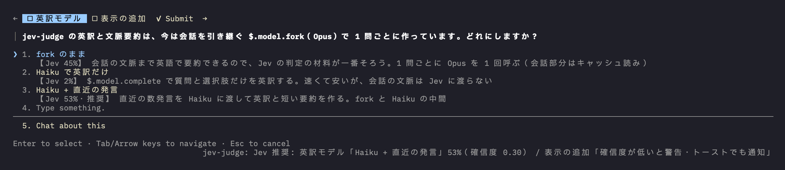
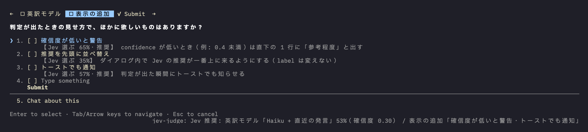

<div align="center">

# kuhaku-plugins

**Small, quiet tools for Claude Code.**

[English](README.md) &nbsp;·&nbsp; [日本語](README.ja.md)

[](LICENSE)
[](https://github.com/anthropics/claude-code)
[](#plugins)

</div>

---

*kuhaku* is Japanese for "blank space". The plugins here try to stay in the margins of your work:
they add a little context where you need it and otherwise keep out of the way.

<br>

## Plugins

| | Plugin | Kind | What it does |
|---|---|---|---|
| 01 | [**jev-judge**](#jev-judge) | mod + skill | Writes TypeSafe Jev's judgment onto Claude's `AskUserQuestion` dialog, and lets you ask Jev directly with `/jev-judge:jev` |

More plugins (skills, mods and other tools) will be added over time.

<br>

## Install

Inside Claude Code:

```text
/plugin marketplace add kuhku/kuhaku-plugins
/plugin install jev-judge@kuhaku-plugins
```

<br>

## jev-judge

> A second opinion, written in the margin of every question Claude asks you.

When Claude asks you something with `AskUserQuestion`, jev-judge asks [TypeSafe](https://typesafe.ai)'s
**Jev** model which option fits the conversation so far, and writes the answer onto the dialog itself.

<p align="center">
  <br>
  <sub>Single-select: probability per option, recommendation, and the summary line below the dialog.</sub>
</p>

<p align="center">
  <br>
  <sub>Multi-select: probability of being worth selecting, per option.</sub>
</p>

- **Per option** — each description starts with Jev's probability; the top one is marked `推奨` (recommended).
- **One line below the dialog** — a summary with Jev's confidence.
- **Multi-select** — a per-option probability of being worth selecting (`【Jev 選ぶ 65%】`).
- **Never in your way** — the dialog opens at once and the judgment arrives a few seconds later.
  Option labels are untouched, so your answer is exactly what you pick.

The labels on screen are in Japanese.

### Skill: `/jev-judge:jev`

Ask Jev about any decision in the conversation: "Jev に聞いて", "jev で判定して" or `/jev-judge:jev`.
Claude picks the decision and its options, writes the question in English (Choice, Noul or Score), sends it with the
bundled `scripts/ask-jev.sh`, and reports the probabilities and confidence back in Japanese, keeping its own view
separate from Jev's.

### How it works

```text
AskUserQuestion ──> fork of the current session ──> TypeSafe API (Jev) ──> dialog redrawn
                    English translation +            Choice per question,
                    context summary                  Noul per option (multi-select)
```

1. The mod asks a fork of the current session (`$.model.fork`: the same model, with the transcript
   served from the prompt cache) to translate the question and options into English and summarize the
   context needed to answer. Jev is asked in English, where it is strongest.
2. It sends that to the TypeSafe API as typed questions.
3. It redraws the dialog with the probabilities and shows the summary line.

### Requirements

| | |
|---|---|
| Claude Code | A build with the function-hooks plugin API. Built and tested on **2.1.289**. The API is early access and may change between releases. |
| TypeSafe API key | Set `TYPESAFE_API_KEY` in the environment Claude Code starts from (for example, your shell profile). Without it, the line below the dialog says the key is missing and the dialog is left as is. |

### Related: the TypeSafe skills

jev-judge calls the TypeSafe HTTP API directly. It does **not** need any other plugin at runtime.

It was designed with TypeSafe's own Claude Code plugin, which teaches Claude how to shape System One
questions (Choice / Noul / Score), state and confidence. Install it if you want Claude's help adapting
jev-judge's questions to your own judgments:

```text
/plugin marketplace add typesafe-ai/skills
/plugin install typesafe@typesafe-ai
```

### Privacy and cost

- **Sent to TypeSafe:** the question, its options and an English summary of the conversation.
- **Per question:** one extra call to your Claude model (mostly prompt-cache reads) and one TypeSafe call.

<br>

## Development

```text
claude plugin validate plugins/jev-judge
claude plugin test plugins/jev-judge
```

To try local changes, add your clone as a marketplace (`/plugin marketplace add <path>`); Claude Code then
reads the plugin from that folder, and `/reload-plugins` picks up edits.

<br>

## License

[MIT](LICENSE) &nbsp;·&nbsp; © 2026 kuhku
